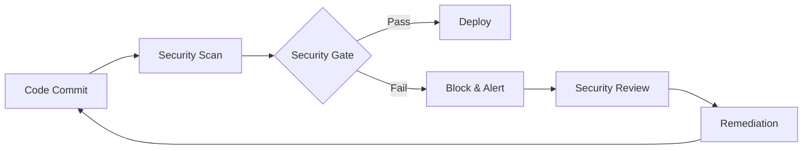

# Security Scanning Infrastructure

This directory contains the comprehensive security scanning infrastructure for the Flask migration project, implementing enterprise-grade security validation with automated vulnerability assessment, compliance monitoring, and security gate enforcement.

## 🔒 Overview

The security scanning infrastructure provides:

- **Comprehensive Vulnerability Assessment**: Container, dependency, and static code analysis
- **Enterprise Compliance**: OWASP Top 10, SOC 2, ISO 27001, and PCI DSS alignment
- **Automated Security Gates**: Critical and high-severity finding enforcement
- **Security Trend Analysis**: Baseline comparison and risk assessment
- **GitHub Security Integration**: SARIF reporting and security tab integration
- **Automated Remediation**: Security finding guidance and resolution tracking

## 📁 Directory Structure

```
.security/
├── README.md                    # This documentation
├── requirements.txt             # Security tool dependencies
├── scripts/                     # Security analysis scripts
│   ├── safety_to_sarif.py      # Safety → SARIF converter
│   └── bandit_baseline_compare.py  # Baseline comparison tool
├── baseline/                    # Security baselines (auto-generated)
├── reports/                     # Security scan reports
└── config/                      # Security configuration files
```

## 🛡️ Security Scanning Components

### Container Security Scanning
- **Trivy 0.48+**: Comprehensive container vulnerability assessment
  - OS package vulnerabilities (CVE database)
  - Application dependency scanning
  - Container misconfiguration detection
  - Secret scanning in container layers
  - Docker CIS compliance validation

- **Docker Scout**: Supply chain security analysis
  - Container image vulnerability assessment
  - Policy violation detection
  - Security best practices validation

### Static Security Analysis
- **Bandit 1.7+**: Python security vulnerability detection
  - Common security anti-patterns
  - Flask-specific security issues
  - JWT and authentication vulnerabilities
  - Input validation weaknesses
  - Configuration security issues

- **Semgrep 1.45+**: Advanced static analysis
  - Security pattern matching
  - Flask framework security rules
  - Custom security rule enforcement
  - OWASP Top 10 vulnerability detection

### Dependency Vulnerability Scanning
- **Safety 3.0+**: Python package vulnerability database
  - CVE database integration
  - Security advisory monitoring
  - Dependency risk assessment
  - Automated remediation guidance

- **pip-audit 2.7+**: Comprehensive dependency auditing
  - PyPI vulnerability database
  - OSV.dev integration
  - Dependency graph analysis
  - SBOM generation support

## 🚨 Security Gate Enforcement

### Severity Thresholds
- **CRITICAL**: Immediate blocking and incident response
- **HIGH**: Build failure with security review requirement
- **MEDIUM**: Warning with tracking (configurable blocking)
- **LOW**: Informational tracking

### Gate Enforcement Policies
```yaml
# Default enforcement configuration
SECURITY_FAIL_ON_CRITICAL: true   # Block on critical findings
SECURITY_FAIL_ON_HIGH: true       # Block on high severity findings
SECURITY_FAIL_ON_MEDIUM: false    # Warning only for medium
```

### Compliance Requirements
- **OWASP Top 10**: Comprehensive vulnerability coverage
- **SANS Top 25**: Software weakness detection
- **SOC 2 Type II**: Security control validation
- **ISO 27001**: Information security management
- **PCI DSS**: Payment card industry compliance

## 📊 Reporting and Integration

### SARIF Integration
Security findings are automatically uploaded to GitHub Security tab in SARIF format:
- Vulnerability details and metadata
- Remediation guidance and references
- Risk scoring and prioritization
- Compliance mapping and context

### Report Formats
- **SARIF**: GitHub Security tab integration
- **JSON**: Programmatic processing and APIs
- **CSV**: Enterprise security tool integration
- **Markdown**: Executive summaries and dashboards

### Dashboard Integration
- **Prometheus Metrics**: Security posture monitoring
- **Grafana Dashboards**: Real-time security visualization
- **SIEM Integration**: Security event correlation
- **Compliance Tracking**: Audit and regulatory reporting

## 🔧 Configuration

### Bandit Configuration
Security analysis configuration is defined in `bandit.yaml`:
```yaml
# Key configuration elements
tests: [B201, B301, B302, ...]  # Security test selection
severity: [HIGH, CRITICAL]      # Enforcement levels
exclude_dirs: [tests, build]    # Scan exclusions
```

### Environment Variables
```bash
# Security scanning configuration
SECURITY_FAIL_ON_CRITICAL=true
SECURITY_FAIL_ON_HIGH=true
SECURITY_BASELINE_PATH=.security/baseline
SECURITY_REPORTS_PATH=.security/reports

# Tool versions
TRIVY_VERSION=0.48.3
BANDIT_VERSION=1.7.5
SAFETY_VERSION=3.0.1
```

## 🚀 Usage

### Automated Scanning (GitHub Actions)
The security workflow runs automatically on:
- **Pull Requests**: Dependency and static analysis
- **Push to Main**: Full security assessment
- **Scheduled**: Daily vulnerability updates
- **Manual Trigger**: On-demand comprehensive scanning

### Manual Security Scanning

#### Container Security
```bash
# Build container for scanning
docker build -t flask-app:security-scan .

# Run Trivy container scan
trivy image --format sarif --output trivy-results.sarif flask-app:security-scan

# Run Docker Scout analysis
docker scout cves --format sarif --output scout-results.sarif flask-app:security-scan
```

#### Static Security Analysis
```bash
# Install security tools
pip install -r .security/requirements.txt

# Run Bandit security analysis
bandit -c bandit.yaml -f sarif -o bandit-results.sarif -r src/

# Run Semgrep security analysis
semgrep --config=auto --config=p/security-audit --sarif --output=semgrep-results.sarif src/
```

#### Dependency Scanning
```bash
# Run Safety vulnerability scan
safety check --json --output safety-results.json

# Run pip-audit analysis
pip-audit --format=sarif --output=pip-audit-results.sarif

# Convert Safety results to SARIF
python .security/scripts/safety_to_sarif.py \
    --input safety-results.json \
    --output safety-results.sarif
```

### Baseline Management

#### Create Initial Baseline
```bash
# Generate security baseline (first scan)
bandit -c bandit.yaml -f json -o .security/baseline/bandit-baseline.json -r src/
```

#### Compare with Baseline
```bash
# Compare current scan with baseline
python .security/scripts/bandit_baseline_compare.py \
    --current bandit-current.json \
    --baseline .security/baseline/bandit-baseline.json \
    --output .security/reports/baseline-comparison.json
```

## 📈 Security Metrics and Monitoring

### Key Security Metrics
- **Vulnerability Count**: Total security findings by severity
- **Risk Score**: Calculated risk assessment (1-9 scale)
- **Compliance Status**: Regulatory requirement compliance
- **Trend Analysis**: Security posture over time
- **Resolution Time**: Mean time to vulnerability remediation

### Prometheus Metrics
```prometheus
# Security scanning metrics
security_vulnerabilities_total{severity="critical|high|medium|low"}
security_scan_duration_seconds{scanner="trivy|bandit|safety"}
security_compliance_score{standard="owasp|sox|iso27001"}
security_gate_failures_total{reason="critical|high|policy"}
```

### Alerting and Notifications
- **Critical Findings**: Immediate security team notification
- **High Risk Trends**: Automated incident creation
- **Compliance Violations**: Stakeholder alerts
- **Gate Failures**: Development team notifications

## 🔄 Security Workflow Integration

### CI/CD Pipeline Integration


### Deployment Integration
- **Pre-deployment**: Security gate validation
- **Blue-Green Deployment**: Security policy enforcement
- **Post-deployment**: Continuous security monitoring
- **Rollback Triggers**: Security incident response

## 🛠️ Troubleshooting

### Common Issues

#### False Positives
- Review and update `bandit.yaml` exclusions
- Add specific finding suppressions
- Update baseline with approved findings

#### Performance Issues
- Configure scan timeouts appropriately
- Use matrix strategies for parallel execution
- Cache security databases and tools

#### Integration Problems
- Verify SARIF format compatibility
- Check GitHub token permissions
- Validate tool version compatibility

### Debug Mode
Enable verbose logging for troubleshooting:
```bash
# Enable verbose output
export SECURITY_VERBOSE=true

# Run with debug information
python .security/scripts/safety_to_sarif.py --verbose
python .security/scripts/bandit_baseline_compare.py --verbose
```

## 📚 Resources and References

### Security Standards
- [OWASP Top 10 2021](https://owasp.org/Top10/)
- [SANS Top 25 Software Errors](https://www.sans.org/top25-software-errors/)
- [NIST Cybersecurity Framework](https://www.nist.gov/cyberframework)
- [SOC 2 Type II Controls](https://www.aicpa.org/interestareas/frc/assuranceadvisoryservices/aicpasoc2report.html)

### Tool Documentation
- [Trivy Documentation](https://aquasecurity.github.io/trivy/)
- [Bandit Documentation](https://bandit.readthedocs.io/)
- [Safety Documentation](https://github.com/pyupio/safety)
- [Semgrep Documentation](https://semgrep.dev/docs/)

### Compliance Frameworks
- [ISO 27001 Information Security](https://www.iso.org/isoiec-27001-information-security.html)
- [PCI DSS Requirements](https://www.pcisecuritystandards.org/pci_security/)
- [GDPR Compliance](https://gdpr.eu/)

## 🤝 Contributing

### Security Tool Updates
1. Update tool versions in workflow configuration
2. Test compatibility with existing baselines
3. Update documentation and examples
4. Validate SARIF output format

### Custom Security Rules
1. Add rules to appropriate configuration files
2. Test against sample code scenarios
3. Update baseline to include new rules
4. Document rule rationale and remediation

### Reporting Enhancements
1. Extend SARIF conversion scripts
2. Add new metric collection points
3. Integrate with additional dashboards
4. Enhance notification systems

---

For additional support or security concerns, contact the Security Team or create a security issue in the repository.